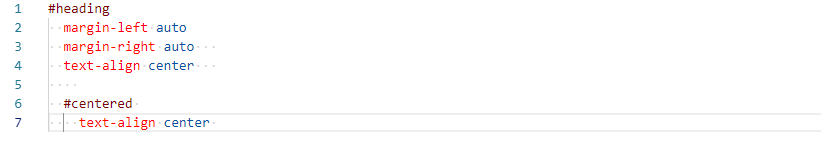

# Whitespace Formatter

## Features

A simple code formatter for all files.

- Trims trailing whitespace.
- Converts indentation to the selected format (tabs or spaces) according to workspace settings.
- Appends a trailing newline at the end of the document if it doesn't exist.

## Extension Settings

This extension contributes the following settings:

- `whitespace.format.enable`: enable/disable whitespace formatting

## Release Notes

### 0.0.1

Initial release of Whitespace Formatter
