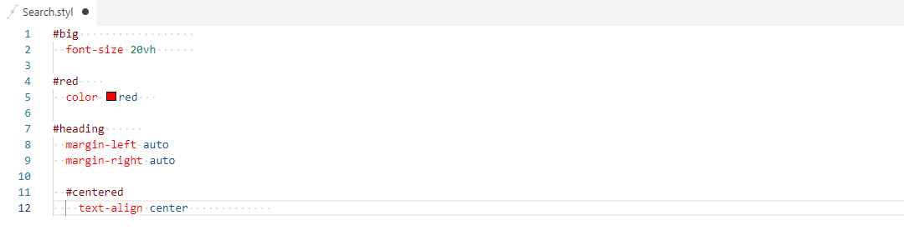

# Whitespace Formatter

## Features

A simple code formatter for all files.

- Trims trailing whitespace.
- Trims trailing newlines exceeding the first one.
- Appends a trailing newline at the end of the document if it doesn't exist.
- Converts indentation to the selected format (tabs or spaces) according to workspace settings.

## Usage

Run `Format Document` command on any file by executing it from Command Palette (`Ctrl + Shift + P`).

You can also set a custom keyboard shortcut for `Format Document` command.

If you want files to be formatted on save set `editor.formatOnSave` to `true`.

## Extension Settings

This extension contributes the following settings:

- `whitespace.format.enable`: enable/disable whitespace formatting

## Release Notes

### 0.1.0

Trims trailing newlines

### 0.0.1

Initial release of Whitespace Formatter
